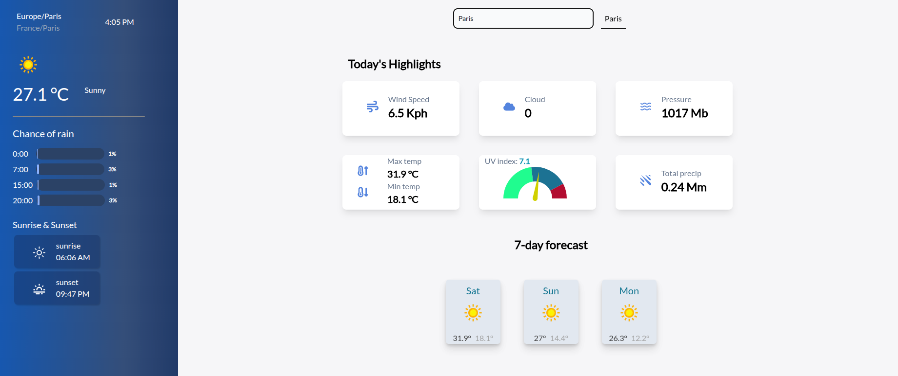

# Weather App (React + Vite)

A simple weather app built with React and Vite, powered by [WeatherAPI.com](https://www.weatherapi.com/).

## Getting Started

### 1. Get an API Key

1. Go to [weatherapi.com](https://www.weatherapi.com/) and sign up for a free account (no credit card required).
2. Once logged in, copy your API key from your dashboard.

### 2. Set Up Environment Variables

Copy the sample env file and add your key:

```bash
cp .env.sample .env
```

Then open `.env` and paste your API key:

```dotenv
VITE_WEATHER_API_KEY=your_api_key_here
```

### 3. Install Dependencies

```bash
yarn
```

### 4. Run the App

```bash
yarn dev
```

The app should now be running locally — check your terminal for the local URL (usually `http://localhost:5173`).

## Preview

